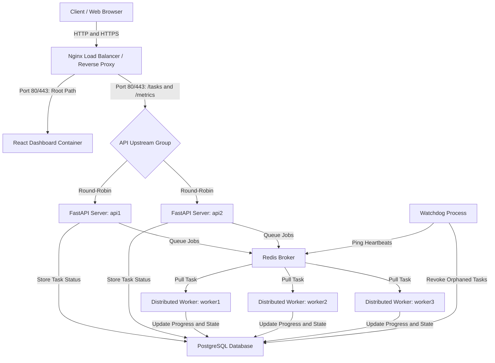

# Orchestrix — Distributed Task Telemetry Dashboard

Orchestrix is a high-performance, containerized distributed task scheduling and real-time execution monitoring engine. Designed for zero-downtime scalability, it utilizes a load-balanced microservices architecture with automatic worker failover, instant SSE (Server-Sent Events) telemetry streams, and a premium glassmorphic dashboard UI.

---

## System Architecture

The following diagram illustrates the flow of client requests, load balancing, message queue distribution, concurrent worker execution, and real-time telemetry streaming:



---

## ⚡ Load-Test Benchmark Results

Orchestrix is engineered to handle heavy concurrent execution workloads with minimal overhead. The system was benchmarked on a single-core, **1 GB RAM AWS EC2 instance (t2.micro)** under a concurrent thread pool load.

### Benchmark Setup
- **Total Tasks**: `500`
- **Task Complexity**: Concurrently executes jobs with a forced `1.0s` sleep (simulating active network/computation workloads).
- **Concurrency**: Distributed across 3 worker containers running 4 concurrent threads each (totaling 12 threads).

### Results
* **Total Tasks Processed**: `500`
* **Total Time Taken**: `46.60 seconds`
* **Average Throughput**: `10.73 tasks/second`
* **Normalized Rate**: `643.83 tasks/minute`
* **Failed Executions**: `0`

---

## 🚀 Setup & Installation (Local Development)

### 1. Prerequisites
Ensure you have the following installed on your machine:
- [Docker](https://www.docker.com/products/docker-desktop)
- [Docker Compose](https://docs.docker.com/compose/install/)

### 2. Run the Stack
1. Clone the repository:
   ```bash
   git clone https://github.com/Sahil-memane/Orchestrix.git
   cd Orchestrix
   ```
2. Create your local environment file:
   ```bash
   cp .env.example .env
   ```
3. Spin up the containers:
   ```bash
   docker compose up -d --build
   ```
4. Access the dashboard:
   - Dashboard UI: `http://localhost`

---

## 🌐 Production Strategy

The Orchestrix stack is optimized for production-ready deployment on lightweight cloud virtual machines (e.g., AWS EC2, Oracle Cloud Instances) utilizing the following strategy:

1. **High-Performance Load Balancing**: Nginx acts as the primary reverse proxy and load balancer, distributing incoming traffic across multiple containerized API replicas and serving static build assets for the dashboard.
2. **Secure HTTPS Routing**: SSL/TLS certificates are managed via Let's Encrypt using Certbot in standalone mode on the host VM, with certificates mounted dynamically as a read-only volume inside the Nginx container.
3. **Resource Efficiency (Swap Space)**: Since the full multi-container stack can exceed 1 GB RAM under concurrent load, allocating a 1–2 GB swap partition on the host OS ensures high availability and prevents Out-Of-Memory (OOM) process termination on cost-effective Free Tier instances.
4. **Resilient Failovers**: A dedicated Watchdog service monitors active worker nodes via a Redis key-value store, automatically revoking and rescheduling tasks if a worker crashes or encounters thread starvation.
